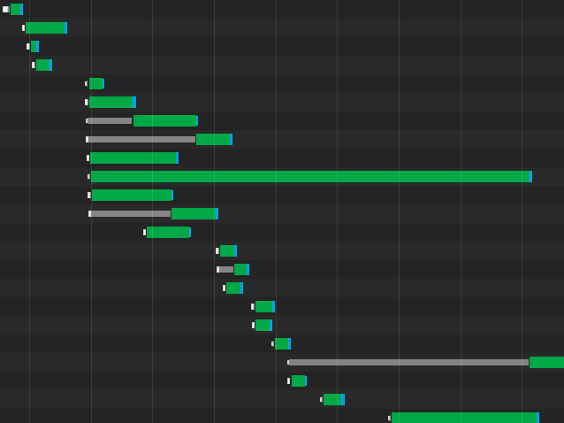
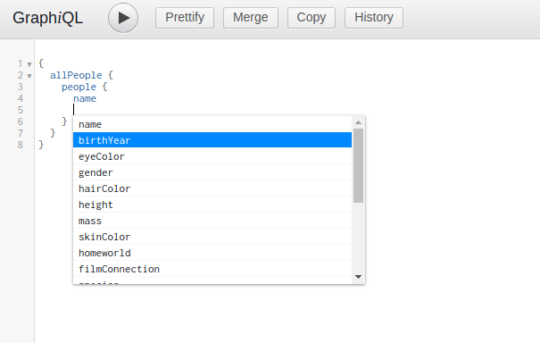

# Varör GraphQL istället för REST?

REST är en väletablerad API-arkitektur som de flesta utvecklare känner till.
Strukturen i ett REST-API är standardiserad, och av denna anledning kan man ofta
lista ut vilka endpoints man kan behöva använda för i princip vilket API som
helst. Detta är både RESTs största styrka och svaghet. Upplägget gör att man
ofta kan behöva göra många stegrade anrop för att samla den information som
krävs för ett visst ändamål, och ofta får man stora mängder data, även om man
bara behöver ett eller två fält. Effekten blir speciellt påtaglig på den moderna
webben där användare förväntar sig snabba sidor, och webbläsaren begränsar
antalet simultana anrop. Det är här GraphQL kommer in i bilden.

Bilden nedan visar ett vattenfallsdiagram över ett antal REST-anrop. Stegringen
beror på att varje anrop bygger på resultatet av de tidigare anropen.

 <small>Ett diagram som visar stegrade
REST-anrop</small>

GraphQL är ett relativt nytt API-format som hjälper oss med samtliga problem vi
nämnt ovan. Anrop till ett GraphQL-API görs alltid med ett POST-anrop till en
enda endpoint, vanligtvis `/graphql`. Studera följande anrop och svar.

**Anrop med fetch:**
```js
fetch('/graphql', {
  method: 'POST',
  headers: {
    'Content-Type': 'application/json',
    'Accept': 'application/json',
  },
  body: JSON.stringify({
    query: `{
      people {
        name
        age
      }
    }`
    })
})
```

**Svar i JSON:**
```json
{
  "people": [
    {
      "name": "Sven-Göran",
      "age": 23
    },
    {
      "name": "Greta-Lisa",
      "age": 67
    }
  ]
}
```

Svaret matchar vårt anrop exakt, vi får alltså inte mer eller mindre data än vad
vi behöver. Vill vi ha mer data behöver vi bara lägga till de relevanta fälten i
vår query. Vi kan till och med hämta releaterad data:

> Hädanefter skriver jag bara query-strängen, inte hela fetch-satsen.

**Anrop:**
```gql
{
  people {
    name
    age
    addresses {
      street
      town
    }
  }
}
```

**Svar:**
```json
{
  "people": [
    {
      "name": "Sven-Göran",
      "age": 23,
      "addresses": [
        {
          "street": "Testgatan 1",
          "town": "Testio"
        },
        {
          "street": "Bullgatan 15",
          "town": "Kanelium"
        }
      ]
    },
    {
      "name": "Greta-Lisa",
      "age": 67,
      "addresses": [
        {
          "street": "Bullgatan 15",
          "town": "Kanelium"
        }
      ]
    }
  ]
}
```

GraphQL låter oss även klumpa samman flera anrop i ett. I exemplet nedan hämtar
vi både en lista på alla personer och alla husdjur i samma anrop:


**Anrop:**
```gql
{
  people {
    name
  }

  pets {
    name
    kind
  }
}
```

**Svar:**
```json
{
  "people": [
    {
      "name": "Sven-Göran"
    },
    {
      "name": "Greta-Lisa"
    }
  ],
  "pets": [
    {
      "name": "Tom",
      "kind": "cat"
    },
    {
      "name": "Jerry",
      "kind": "mouse"
    }
  ]
}
```

Dessa egenskaper gör att vi slipper hämta onödig data, kan hämta relaterad data
utan stegrade anrop, och kan kombinera flera anrop i ett.

Vi kan även skicka med argument till vårt API med hjälp av en funktions-liknande
syntax. I exemplet nedan hämtar vi endast katter:

**Anrop:**
```gql
{
  pets (kind: "cat") {
    name
    kind
  }
}
```

**Svar:**
```json
{
  "pets": [
    {
      "name": "Tom",
      "kind": "cat"
    }
  ]
}
```

Sist men inte minst kan vi även köra vad man skulle kunna kalla funktioner i
vårt anrop. Hittills har vi endast kört queries, men genom att benämna ett block
i vårt anrop med nyckelordet `mutation` kan vi även modfiera datan på servern. I
exemplet nedan skapar vi ett nytt husdjur:

**Anrop:**
```gql
mutation {
  createPet (
    name: "Milou"
    kind: "dog"
  ) {
    name
  }
}
```

**Svar:**
```json
{
  "createPed": {
    "name": "Milou"
  }
}
```

En av styrkorna vi nämnde tidigare med REST var att det var enkelt att lista ut
vilka endpoints som fanns på APIt. Ett GraphQL-API har ingen självklar struktur,
utan erbjuder istället en funktion som kallas instrospection. Introspection är
ett separat API som GraphQL automatiskt genererar som beskriver hur det primära
API't är strukturerat. Att använda introspection-API't manuellt kan vara lite
klurigt, men det finns bra verktyg byggda på introspection-API't som låter oss
utforska ett GraphQL-API grafiskt, t.ex. GraphiQL.



Förhoppningsvis har du nu en bättre överblick av GraphQL och vilka fördelar det
har över REST.
